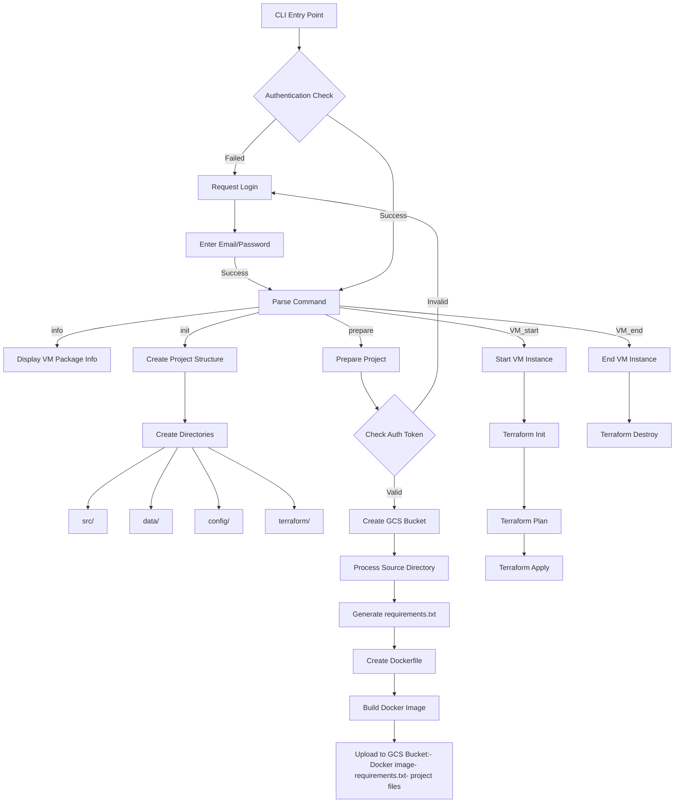

```mermaid
flowchart TD
    A[CLI Entry Point] --> B{Authentication Check}
    B -->|Failed| C[Request Login]
    C --> D[Enter Email/Password]
    D -->|Success| E[Parse Command]
    B -->|Success| E
    
    E -->|info| F[Display VM Package Info]
    
    E -->|init| G[Create Project Structure]
    G --> G1[Create Directories]
    G1 --> G2[src/]
    G1 --> G3[data/]
    G1 --> G4[config/]
    G1 --> G5[terraform/]
    
    E -->|prepare| H[Prepare Project]
    H --> H1{Check Auth Token}
    H1 -->|Valid| H2[Create GCS Bucket]
    H2 --> H3[Process Source Directory]
    H3 --> H4[Generate requirements.txt]
    H4 --> H5[Create Dockerfile]
    H5 --> H6[Build Docker Image]
    H6 --> H7[Upload to GCS Bucket:- Docker image- requirements.txt- project files]
    H1 -->|Invalid| C
    
    E -->|VM_start| I[Start VM Instance]
    I --> I1[Terraform Init]
    I1 --> I2[Terraform Plan]
    I2 --> I3[Terraform Apply]
    
    E -->|VM_end| J[End VM Instance]
    J --> J1[Terraform Destroy]
```
